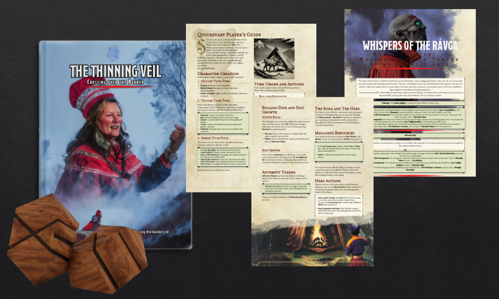
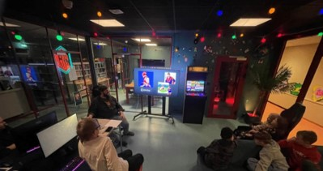

---
# You don't need to edit this file, it's empty on purpose.
# Edit theme's home layout instead if you wanna make some changes
# See: https://jekyllrb.com/docs/themes/#overriding-theme-defaults
layout: splash
author_profile: false
header:
  overlay_color: "#e1bc48"
  image: "/assets/images/bg-pattern.png"
---
# Sámi AI Lab

Sámi AI Lab is a research group located at [Sámi University of Applied Sciences](https://samas.no/) in Guovdageiadnu, Norway and [UiT The Arctic University of Norway](https://uit.no/startsida) located in Tromsø, Norway. We investigate possibilities for AI to improve the Indigenous Sámi experience through artificial intelligence technologies.

## It is urgent to ensure that Indigenous Peoples are not left behind by new AI apps and services

### Problem
The widespread integration of new AI apps and services into critical public sectors like healthcare and education is inevitable. For these applications to be effective and equitable, language and culture are paramount. However, existing non-AI tools consistently fail to support Sámi and Indigenous Peoples, resulting in a systemic service gap, such as lower quality healthcare and greater drop-out in Indigenous language education. While new AI tools offer the unique opportunity to finally build culturally and linguistically adapted services where none currently exist, this possibility is conditional. It requires deliberate action to include Indigenous data and expertise in the foundation: from developing the core models and building the applications to rigorously evaluating the services.

### Our mission
The Sámi AI Lab aims to establish Sámi self-determination in the digital age. We develop and deploy culturally-adapted AI apps and services, not for AI's sake, but as essential tools to solve the urgent inequities in health services, language preservation, and cultural innovation. We ensure the necessary Indigenous data and expertise are built into the core of these applications, making the Sámi model a global standard for ethical, applied Indigenous AI. 

## Our core focus is delivering AI solutions to secure health equity and develop Sámi culture and languages

### Health Equity
*The Problem.* Indigenous communities currently lack culturally and linguistically adapted health tools. This absence of normed clinical assessments creates a severe diagnostic barrier, particularly for Sámi children and elders who may be underserved by majority-language healthcare systems.

*Our Solution.* We are establishing a robust methodology for norming cognitive and mental health tests in low-resource languages like Northern Sámi. In tandem, we are developing AI-driven solutions that enable non-Sámi-speaking clinicians to administer these assessments accurately and ethically.

*Impact.* Guarantees equitable access to diagnosis and treatment for the Sámi population, effectively closing the "none-to-state-of-the-art" service gap in Indigenous healthcare.

*Concrete Outcomes.* This research is currently being spearheaded through an ongoing postdoctoral project. While the work is in its developmental phase, the anticipated outcomes include a validated suite of Sámi-specific cognitive assessment tools and a functional AI-assisted platform for clinical administration.

### Language and Educations

*The Problem.* Sámi speakers frequently encounter digital and social barriers that prevent them from using their native language freely. This often leads to "language compromise"—the forced shift to a majority language—which hinders natural communication, slows down learners, and erodes cultural preservation.

*Our Solution.* We developed the Ábo Web Service, an AI-enabled speech-to-text tool designed to bridge the communication gap. The service allows users to speak naturally in Sámi, utilizing advanced AI to transcribe and translate their speech in real-time, removing the technical friction of language switching.

*Impact.* Gives Sámi speakers the autonomy to use their language without compromise in digital spaces. By making the language more visible and easier to document, Ábo supports both fluent speakers in professional settings and learners seeking to build confidence.

*Concrete Outcomes.* The project has resulted in a functional, public-facing web platform and has garnered significant attention within Sámi media for its role in modernizing language use.

Try the service: [Ábo Web Page](https://samiailab.samas.no/abo/)

In the news: Ávvir: [Juo, dat lea dehálaš Sápmái](https://www.avvir.no/juo-dat-lea-dehalas-sapmai/), and Ságat: [Gjør det enklere å delta i samtalen](https://www.sagat.no/gjor-det-enklere-a-delta-i-samtalen/19.56598).

### Creative Industries

*The Problem.* Sámi cultural heritage faces significant challenges in intergenerational transmission and accurate digital representation. Standard creative tools often lack the nuance required to represent traditional knowledge and duodji (Sámi handcraft), leading to cultural dilution or invisibility in modern media.

*Our Solution.* We are developing specialized Generative AI tools and creative workflows designed to digitally encode and accurately represent Sámi duodji and traditional knowledge. This includes training models that respect the specific aesthetics and cultural protocols of Sámi craftsmanship.

*Impact.* Supports the preservation of intricate duodji techniques and facilitates cultural identity reclamation. By embedding Sámi heritage into modern AI workflows, we increase Sámi visibility in popular culture and empower creators to build within their own cultural context.

*Concrete Outcomes.* This work is being actively advanced through ongoing Master’s and PhD research projects, with the following current outputs:
- [Huggingface Repository](https://huggingface.co/Sami-AI-Lab): Open-access datasets and trained LoRA models designed for generating culturally accurate Sámi imagery.
* Sámi Tabletop RPG: A culturally rooted role-playing game documented in peer-reviewed research. This work is published in ACM CHI Play 25: [Storycrafting With Constraints: Sámi Storytelling and Generative AI Workflows](https://dl.acm.org/doi/full/10.1145/3744736.3749342). We also describe the work in this [video](https://dl.acm.org/doi/suppl/10.1145/3744736.3749342/suppl_file/10.1145_3744736.3749342-video.mp4). We have also presented the work at NordiCHI '24 workshop, and as a poster at UNESCO LT4All 2025.
* Presentation: "Bridging Sámi traditional knowledge and artificial intelligence" at WIPCE 2025.

In the news: NRK: [Dette mener KI er samisk](https://www.nrk.no/norge/dette-mener-ki-er-samisk-1.16761140), Anaráš aavis:[Kielâteknologia puohháid: LT4ALL-konferens Pariisist](https://www.anarasaavis.fi/2025/03/03/kielateknologia-puohhaid-lt4all-konferens-pariisist/).

### Language Technology Evaluation

*The Problem.* While Large Language Models (LLMs) are beginning to support (Northern) Sámi, the specialized benchmarks and tools required to evaluate their linguistic accuracy and cultural fidelity remain largely absent. Without these metrics, it is impossible to verify if AI outputs are linguistically correct or culturally appropriate.

*Our Solution.* We are developing rigorous benchmarks and evaluation frameworks to measure the performance of LLMs and AI applications specifically regarding Sámi language, culture, and traditional knowledge. This technical infrastructure allows for the objective assessment of AI models before they are deployed in community-facing roles.

*Impact.* Ensures that Sámi AI services reach the same quality standards as those for major global languages. This facilitates the safe and effective integration of AI into high-stakes sectors—such as healthcare and education—where accuracy and cultural safety are non-negotiable.

*Concrete Outcomes.* This research is currently being advanced through an ongoing Master’s project. While the benchmark is in its developmental phase, our current efforts include:
- Sámi Understanding Benchmark: Development of a comprehensive evaluation set for testing language and cultural nuance in LLMs.
- [WMT’26 Collaboration](https://www2.statmt.org/wmt26/index.html): Partnering with the [TartuNLP](https://nlp.cs.ut.ee/) research group to include Northern Sámi in the WMT’26 (Conference on Machine Translation) competition, promoting international research and higher standards for Sámi machine translation.

In the news: NRK Sápmi: [Dahkujierbmi sáhttá ovddidit sámegiela](https://www.nrk.no/sapmi/google-dahkujierbmi-gemini-haldda_a-davvisamegiela-1.17752486), SVT: [Experten: Samisk AI kan bli verklighet inom fem till tio år](https://www.svt.se/nyheter/sapmi/experten-samisk-ai-kan-bli-verklighet-inom-fem-till-tio-ar).

## Sámi-led governance our community roots give us the authority to shape AI regulations and standards

*Ethical Standards.*  The Sámi AI Lab is hosted by the Sámi University of Applied Sciences, an Indigenous-led institution, embedding us directly within the Sámi community. This foundation ensures*:
- Value Alignment: As AI becomes a core technology for the Sámi, all solutions we develop are strictly aligned with Sámi ethical norms and values.
- Bias Prevention: We actively prevent AI from encoding systemic bias or misrepresenting Sámi culture, a critical risk when non-Indigenous models are used.

*Global Leadership.* We are defining the standard for ethical, applied Indigenous AI:
- Inclusion Mandate: Our most important goal is to ensure Indigenous Peoples are fully included in the design, regulation, and deployment of future AI solutions.
- Policy Participation: We lead the effort to incorporate Indigenous ethical norms into national and international AI regulation, securing the right to equitable and culturally adapted AI services.

We have published two statements for the implementation of the EU AI Act (from [Sámi allaskuvla](https://www.regjeringen.no/no/dokumenter/3112327/id3112327/?uid=63d2f755-293e-44c7-a1b4-eb5915a19d2d) and [UiT Norges arktiske universitet](https://www.regjeringen.no/no/dokumenter/3112327/id3112327/?uid=7e15f708-dcf4-44a5-a39c-615867f892e3), and we are organizing a side-event at the 25th Permanent Forum on Indigenous Issues (UNPFII) about *AI opportunities for Indigenous health: realizing benefits and addressing risks*.

In the news: NRK Sápmi: [Aalkoeåålmegidie birrie DJ-evtiedimmiem stuvredh](https://www.nrk.no/sapmi/aalkoeaalmegidie-birrie-dj-evtiedimmiem-stuvredh-1.17660246) and [Ber urfolk ta styring i KI-utviklingen](https://www.nrk.no/sapmi/ber-urfolk-ta-styring-i-ki-utviklingen-1.17659108), Anaráš aavis: [Lars Ailo Bongo lii vuáittám tahojiermi maaŋgâ­hámásâš­vuođâ palhâšume Taažâst](https://www.anarasaavis.fi/2025/06/12/lars-ailo-bongo-lii-vuaittam-tahojiermi-maangahamasasvuoda-palhasume-taazast/).

## Outreach & Community Engagement

We believe it is vital that the Sámi community is at the forefront of the AI revolution. Our goal is to move beyond being passive consumers of technology; we want to empower Sámi people to become active creators who can harness the possibilities of AI while leading the conversation on Indigenous data ethics and digital sovereignty.

{: .align-center width="70%" }
{: .align-center }

To bridge the gap between research and the community, we are heavily involved in outreach and knowledge-sharing across Sápmi:
- *AI Workshops for Schools*: We provide hands-on AI education for the next generation. We have successfully delivered workshops in Guovdageaidnu and Kåfjord, with an upcoming session planned for Alta.
  - Interested in a workshop? We are always looking to connect with new schools. Please [contact us](mailto:larsab@samas.no) if you would like us to visit your classroom.
- *Specialized Craft Training*: We have conducted dedicated workshops for duodji students at Sámi allaskuvla (Sámi University of Applied Sciences), exploring how AI can support traditional handcraft without compromising cultural integrity.
- *Public Advocacy & Lectures*: Our lab has delivered dozens of presentations at international conferences and meetings of relevant Indigenous organizations. We also frequently give popular science lectures to make AI concepts accessible to the general public.

Through these activities, we ensure that the development of AI remains a transparent, community-driven process that respects and reflects Sámi values.

## People

Sámi AI Lab members:
1. Professor Lars Ailo Bongo (PI; Sámi allaskuvla and UiT)
2. Assistant Professor Samuel Valkeapää (Creative industries lead; Sámi allaskuvla)
4. Associate Professor Kajsa Møllersen (Language and education lead; Sámi allaskuvla)
5. Anne-Torill Nordsletta (researcher)
6. Dr. Nikita Shvestov (Health equity; postdoc, UiT)
7. Ernie Roby-Tomić (Creative industries; PhD student, UiT)
8. Maarit Magga (Language and education; Developer, Sámi allaskuvla)
9. Ragnhild Abel Grape (Language Technology Evaluation; Master student, UiT)
10. Kevin Mathias Bergan (Creative industries; Master student, UiT)

Collaborators:
1. Brita Elvevåg (UiT, Health equity)
2. Benjamin Ricaud (UiT, Language Technology Evaluation)
3. Sandra Just (UiT, Health equity)
4. Ánde Somby (UiT, Creative Industries)
5. Outi Laiti (University of Helsinki, Creative Industries)

## Contact information

Lars Ailo Bongo: larsab@samas.no 

Sámi allaskuvla,  
Hánnoluohkká 45,  
NO-9520 Guovdageaidnu,  
Norway
